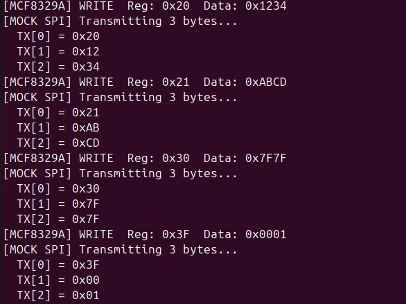
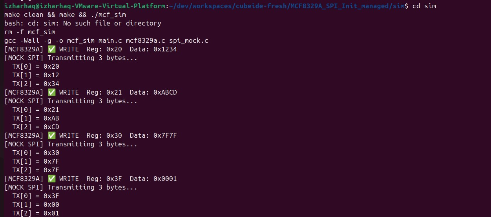
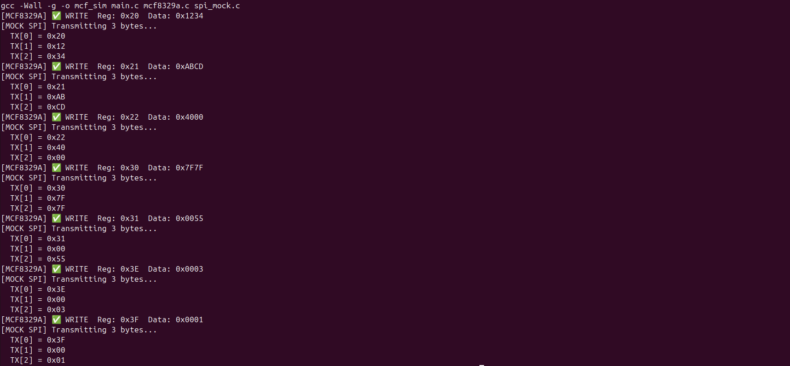

# MCF8329A SPI Firmware for STM32 – BLDC Motor Driver Initialization

 https://github.com/izharhaq1987/MCF8329A_SPI_Firmware/releases


###  Objective

This project demonstrates STM32 firmware to configure the **Texas Instruments MCF8329A** BLDC motor driver over SPI, simulating initialization behavior without requiring any physical hardware.

The simulation uses:
-  Mock SPI layer
-  Fake register map
-  Detailed logging


###  Features

- Simulated **register-level SPI write** implementation
- No hardware required (entirely software-driven)
- STM32-style `MX_SPI1_Init()` logic abstracted
- `mcf8329a_write_register()` with frame-level SPI breakdown
- Buildable via **Makefile**
-  Testable on any Linux system


###  Simulation Output

Below are real simulation logs captured via `make && ./mcf_sim`:

####  SPI Write Log



####  Register Initialization Sequence



####  Terminal Output Snapshot



---

###  How to Run the Simulation

####  Dependencies
- GCC (native)
- Make

####  Build & Run

```bash
cd sim
make clean && make
./mcf_sim

